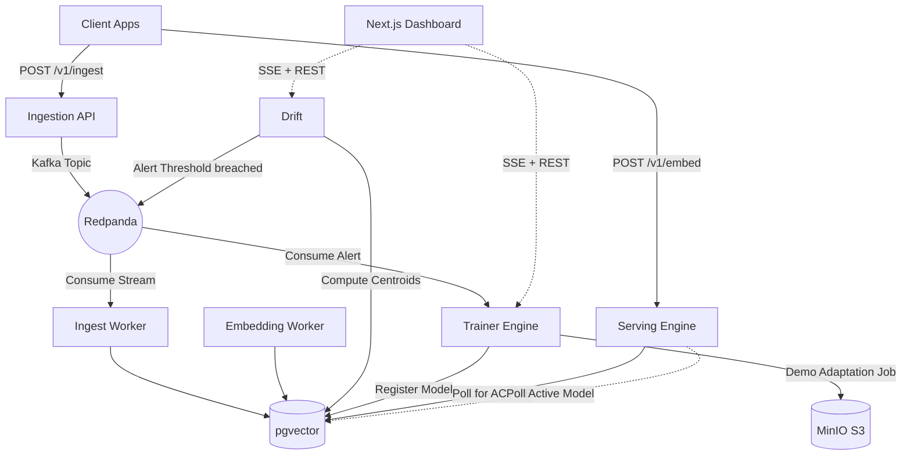

# Continuum 🌌

**Continuum** is a local real-time embedding drift detection and adaptive model registry demo.

Every production RAG and semantic search system suffers from semantic drift over time. The distribution of data flowing through the system shifts away from the distribution the embedding model was originally trained on. Continuum demonstrates the control loop: ingest documents, compute embeddings, score centroid drift, trigger an adaptation job, register a candidate model, and activate it from the dashboard.

## Architecture



## Production Ops

Continuum has two migration tracks. Prisma owns the product schema in
`packages/shared/prisma/migrations`; Alembic owns operational tables for hashed API keys,
request metrics, and rollback audit events in `packages/shared/alembic`.

```bash
pnpm ops:migrate
pnpm ops:migrate:test
```

Docker Compose runs the same Alembic upgrade through the `migrations` one-shot service before app
containers become eligible to serve traffic.

Long-running services declare `restart: unless-stopped` so a crash does not silently remove a
service from the loop. The one-shot containers (`redpanda-init`, `minio-init`, `migrations`)
deliberately have no restart policy, because dependents wait on them via
`service_completed_successfully` and a restart loop would block startup forever.

`DATABASE_URL` pins `connection_limit=10&pool_timeout=30`. Left implicit, Prisma sizes its pool
from the CPUs the container can see (`num_cpus * 2 + 1`), which the per-service `cpus` limits
reduce to 3 — small enough that the drift services exhaust it under sustained load and exit on
`Timed out fetching a new connection from the connection pool`. Postgres runs with
`max_connections=200` to leave headroom above the summed pools for migrations and seeding.
Alembic strips the Prisma-only parameters before psycopg sees the URL
(`continuum_shared.db_url`), since libpq rejects connection options it does not recognise.

Every FastAPI service emits structured JSON logs with an `x-correlation-id` value, and local
OpenTelemetry spans are exported to stdout. Set `API_KEY_BCRYPT_HASH` instead of `API_KEY` in
real deployments; plaintext `API_KEY` exists only for local development compatibility.

`retention-worker` runs the cleanup policy on a schedule:

- embeddings older than `RETENTION_EMBEDDINGS_DAYS` (default 90)
- drift and linguistic windows older than `RETENTION_DRIFT_WINDOWS_DAYS` (default 30)
- training jobs older than `RETENTION_TRAINING_JOBS_DAYS` (default 365)

`DRIFT_TRIGGER_MIN_EMBEDDING_DRIFT` is on the same scale as `DRIFT_THRESHOLD`: centroid cosine
distance, where a domain shift reads around 0.10. Keep it at or below the alert threshold, or the
throttler suppresses every alert the drift service raises and only linguistic drift can trigger
training.

The serving engine tracks request outcomes per model version. If the active model exceeds
`ROLLBACK_ERROR_RATE_THRESHOLD` over `ROLLBACK_WINDOW_SECONDS` with at least
`ROLLBACK_MIN_REQUESTS`, it archives the failing version, restores the previous active model,
and records a rollback event.

## Running it in a Codespace

`.devcontainer/` configures a Codespace with Docker-in-Docker and the ports the stack
publishes. It requests **8 CPUs and 32 GB**: the app services alone declare 9.2 GB of
memory limits and 8 CPUs, the infrastructure containers are unbounded on top of that, and
serving is CPU-bound even at rest.

Create the Codespace, wait for setup, then follow the quickstart below. Port 3000 forwards
automatically once the dashboard is healthy.

Codespaces bill by core-hour while running, storage while stopped, and nothing once
deleted, so stop or delete it when finished.

## Quickstart (E2E Demo)

Boot up the entire infrastructure and microservices with Docker Compose:

```bash
docker compose up --build -d
```

Compose healthchecks gate the app startup path: APIs wait for Redpanda/Postgres/Redis/MinIO as needed, and the dashboard waits for the drift and trainer APIs to become healthy.

To verify the exposed services from the host after startup:

```bash
pnpm stack:health
```

1. Open the Dashboard at `http://localhost:3000`
2. Run the seed script to inject baseline data and then induce a drift event:
   ```bash
   uv run scripts/seed.py
   ```
3. Watch the Dashboard as the drift score spikes, the training job triggers, and the new model version is produced!
4. Inspect retrieval quality for the active model on the new domain:
   ```bash
   pnpm bench:retrieval
   ```
5. Or verify the full demo narrative end-to-end:
   ```bash
   pnpm demo:verify
   ```

See [DEMO.md](DEMO.md) for a detailed walkthrough.

### Trainer Backends

`TRAINER_BACKEND` defaults to `peft`: a drift alert trains
`sentence-transformers/all-MiniLM-L6-v2` with a LoRA adapter under a symmetric in-batch
contrastive objective, merges the adapter, exports ONNX through Optimum, and uploads the
artifacts to MinIO. Torch is installed only into the trainer image, through the
`INSTALL_EXTRAS` build arg, so the services that infer through ONNX Runtime stay lean.

The candidate is then scored against the base model on the same held-out documents and
promoted only if it clears `ACTIVATION_MIN_IMPROVEMENT`. Activation re-indexes the corpus:
vectors from two different encoders are not comparable, so an adapted model serving against
an index built by its predecessor would degrade retrieval and register as drift that never
happened.

The re-encoding is done by the embedding worker, which claims documents whose stored vector
carries a model version other than the active one. Activation is the only signal needed —
the mismatch is the work queue. That makes re-indexing resumable across restarts and spread
over however many worker replicas are running, rather than blocking the training job for the
length of a full pass.

It is a full backfill: the predicate matches every historical document, not only new
arrivals. Two limits are worth stating. There is no dual index, so retrieval spans a mix of
old and new vectors until the backfill finishes. And the claim is unordered, so freshly
ingested documents compete with the backlog rather than taking priority.

Drift windows are built from `first_embedded_at`, which records when a document first became
searchable and is never updated. `created_at` moves on every write, so a backfill would
otherwise restamp the whole corpus into the current window and the drift score measured
during one would describe every document rather than recent arrivals.

`TRAINER_BACKEND=demo_adapter` selects the original deterministic projection instead. It
trains nothing, and exists for a fast laptop demo.

### Linguistic Drift

`continuum-linguistic-drift` adds a second drift signal over raw document text. It compares
rolling windows against the baseline corpus for entity movement, topic movement, and
vocabulary shift, stores results in `linguistic_windows`, publishes `linguistic-drift-alerts`,
and streams live dashboard updates from `http://localhost:8004/v1/linguistic/events`.

Entities come from spaCy `en_core_web_sm`, installed into the service image along with the
model — spaCy ships no model with the package, and a missing one silently degrades entity
extraction to a capitalised-word regex. That regex is still there as a fallback, but it now
says so: it cannot tell a person from a product from a sentence-initial word, and it labels
every match the same, so a report built on it is weaker and the extractor records which
backend produced it.

Topics use TF-IDF keyword grouping by default. BERTopic is available through the separate
`topics` extra and is not installed, because it depends on sentence-transformers and so
pulls torch, umap-learn, hdbscan, numba and pandas into a service that needs none of them.
On windows of a few hundred short posts its clusters are also unstable enough to move the
topic distribution between runs on identical input.

## Seed Corpus

`uv run scripts/seed.py` ingests real documents, not generated text: 700 posts from
`comp.sys.ibm.pc.hardware` as the baseline, then 500 from `comp.sys.mac.hardware` as the
drifted window, drawn from the
[20 Newsgroups](https://huggingface.co/datasets/SetFit/20_newsgroups) dataset. Every document
is distinct — the corpus is deduplicated and walked rather than sampled with replacement.

The pair was chosen by measurement. A domain shift only demonstrates adaptation if the base
model has somewhere left to improve, and MiniLM already separates unrelated subjects almost
perfectly:

| candidate pair                             | drift separation | baseline MRR         |
| ------------------------------------------ | ---------------- | -------------------- |
| `comp.*` vs `sci.med`                      | 0.9156           | 0.9833 — no headroom |
| `sci.med` vs `sci.electronics`             | 0.8886           | 0.9670 — no headroom |
| `rec.sport.baseball` vs `rec.sport.hockey` | 0.3457           | 0.9352 — usable      |
| **`pc.hardware` vs `mac.hardware`**        | **0.1760**       | **0.8591 — chosen**  |

A live run against `comp.* vs sci.med` measured baseline MRR at 0.9993, so no adapter could
register an improvement and the pipeline correctly rejected the candidate. Two flavours of
hardware support discussion share vocabulary and structure, which leaves real headroom.

Because that drift is subtler, `DRIFT_THRESHOLD` sits in a narrow band. Measured:

| window                                         | drift score |
| ---------------------------------------------- | ----------- |
| within-domain (PC vs PC, false-positive floor) | 0.0629      |
| 50% Mac                                        | 0.0789      |
| 75% Mac                                        | 0.1184      |
| 100% Mac                                       | 0.1728      |
| `DRIFT_THRESHOLD`                              | 0.08        |

0.08 clears the noise floor and trips on a drift-dominated window. Lowering it below ~0.065
would alert on a stable distribution.

## Scaling the workers

`embedding` and `ingest-worker` declare no `container_name` and publish no ports, so they
can be run with replicas:

```bash
docker compose --env-file .env -f infra/docker-compose.yml up -d --scale embedding=3
```

Both are safe to replicate. The embedding worker claims rows with
`FOR UPDATE ... SKIP LOCKED`, so replicas take disjoint batches without coordinating, and
the ingest worker is a Kafka consumer group over three partitions, so the broker assigns
each partition to one member.

Everything else keeps a fixed name deliberately. `redpanda-init`, `minio-init` and
`migrations` must run exactly once for `service_completed_successfully` to mean anything,
and a second `retention-worker` would duplicate the deletions the first is making.

## Retrieval Benchmark

`pnpm bench:retrieval` scores 100 held-out queries, 50 per domain, against the serving API.
Each query is the opening fifteen words of a post; the document is the rest of that post,
and it is the only relevant result among all 100 candidates. The split keeps the query out
of its own document, so a hit means the model matched meaning rather than finding a copy of
the query string.

This is deliberately harder than the gate the trainer applies to itself, which counts any
document from the same newsgroup as relevant. Half the candidates qualify under that rule,
which is why it reports MRR around 0.88 — a number that says more about the task than the
model. Finding one specific post among a hundred is something a retrieval model can be
wrong about.

CI runs it after the latency benchmark and publishes per-domain MRR, recall@1, recall@5 and
NDCG@10 to the job summary.

NDCG is graded rather than binary. With one relevant document per query it would be a
monotone transform of the rank and would carry exactly the information MRR already does.
Grading a same-domain document above an unrelated one makes it a separate signal: whether a
model that misses the exact document still keeps the right domain near the top. A model
losing its grip on a drifted domain should lose that coherence, not only its exact-match
precision. The gate reports it but does not promote on it, so adding the metric cannot
change which models ship.

## Serving Latency

`pnpm bench:latency` measures p50/p95/p99 against a running stack at batch sizes 1, 8 and
32, using documents from the same corpus the demo ingests. Payload length matters: latency
on a transformer scales with sequence length, so measuring with short synthetic strings
understates it substantially.

CI runs it after the E2E smoke against the same images and resource limits, publishes the
table to the job summary, and uploads the raw JSON as an artifact.

Percentiles are nearest-rank rather than interpolated, so every figure is a latency some
request actually took.

## Embeddings

Documents are embedded with `sentence-transformers/all-MiniLM-L6-v2`, run through ONNX Runtime
rather than torch: the published ONNX export plus a tokenizers vocabulary keeps the service
images small, and the serving engine already loads ONNX sessions for adapted models.

The weights are baked into the image at build time (`scripts/fetch_embedding_model.py`), so no
container reaches the network at startup and every replica serves byte-identical vectors. Drift
is measured by comparing centroids over time, so replicas on different revisions of the model
would register as drift that never happened.

Pooling — attention-masked mean, then L2 normalisation — is duplicated in
`continuum_trainer.peft_engine`. The two must stay in step: an adapter trained under one
pooling strategy and served under another yields vectors that are silently incomparable with
the baseline centroids.

## Measured Results

An independent benchmark over 100 held-out queries shows retrieval on the drifted domain is
28% worse than on the baseline domain: MRR 0.434 against 0.605. That is drift appearing as a
measurable loss of quality rather than only as a moving centroid.

A LoRA adaptation of `all-MiniLM-L6-v2` over that window tunes 337,920 parameters, 1.47% of
the model. Across five runs on in-batch negatives the gain appeared only where the training
window captured enough data: −0.49%, +0.62% and +0.87% from 124 to 250 examples, against
+9.86% and +8.29% from 400 and 450. Mined hard negatives now ship as well, and three runs
measured +1.17%, +4.22% and +7.02% — better where the previous objective did nothing, worse
at the one size that allows a direct comparison, and not separable from run-to-run variance
either way. All eight runs fell below the 10% activation gate, so the pipeline kept serving
the baseline rather than shipping a model it could not justify.

Serving latency is measured in CI: median 27–71 ms at batch 1 and 1.6–3.4 s at batch 32
across three runs, against a spec target of p99 under 50 ms at batch 32. Raising the
serving container from 0.50 to 2.00 CPU and replacing fixed 256-token padding with dynamic
padding cut batch-32 latency about 3x; the remaining gap is throughput under batching, and
it is recorded rather than tuned away.

Full figures, method, and the CI run that produced them:
[docs/benchmarks/RESUME_METRICS.md](docs/benchmarks/RESUME_METRICS.md).

## Type checking

`pnpm type-check:py` runs mypy in strict mode over the shared package and the modules that
decide what gets served: retrieval scoring, the promotion gate, the rollback policy and the
embedding worker. Those are clean.

The other 33 modules are not covered yet. Enabling everything reports 134 errors, 92 of them
missing annotations and the untyped calls that follow from them; the remainder is friction
at the Prisma and protobuf boundaries, where generated code carries no types. None of the
134 is a runtime defect. The scope is listed explicitly in `pyproject.toml` rather than
being implied, so what is and is not checked stays visible.

## Validation

The default checks do not require Docker:

```bash
pnpm lint
pnpm type-check
pnpm test
pnpm build
docker compose config -q
```

To verify the complete compose stack from a clean local state:

```bash
docker compose --env-file .env.example -f infra/docker-compose.yml down -v
docker compose --env-file .env.example -f infra/docker-compose.yml up --build -d --wait
pnpm stack:health
pnpm demo:verify
```

Docker-backed Testcontainers checks are opt-in:

```bash
pnpm test:integration
```

## Services Overview

- **`apps/ingest`**: FastAPI service that validates document payloads and produces idempotently to Kafka.
- **`apps/embedding`**: Embeds documents with `all-MiniLM-L6-v2` via ONNX Runtime and stores the vectors in pgvector.
- **`apps/drift`**: Computes rolling centroids of the embedding space and fires alerts based on cosine distance.
- **`apps/trainer`**: Runs a deterministic demo adaptation/evaluation job before registering models.
- **`apps/server`**: REST + gRPC embedding service with active-model polling and hot-swap state.
- **`apps/dashboard`**: Next.js 15 UI for monitoring drift, training telemetry, and the model registry.
