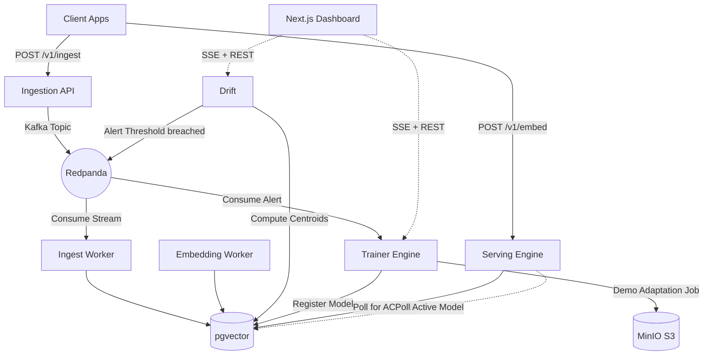

# Continuum 🌌

**Continuum** is a local real-time embedding drift detection and adaptive model registry demo.

Every production RAG and semantic search system suffers from semantic drift over time. The distribution of data flowing through the system shifts away from the distribution the embedding model was originally trained on. Continuum demonstrates the control loop: ingest documents, compute embeddings, score centroid drift, trigger an adaptation job, register a candidate model, and activate it from the dashboard.

## Architecture



## Quickstart (E2E Demo)

Boot up the entire infrastructure and microservices with Docker Compose:

```bash
docker compose up --build -d
```

1. Open the Dashboard at `http://localhost:3000`
2. Run the seed script to inject baseline data and then induce a drift event:
   ```bash
   uv run scripts/seed.py
   ```
3. Watch the Dashboard as the drift score spikes, the training job triggers, and the new model version is produced!
4. Verify the new model improves MRR on the new domain:
   ```bash
   uv run eval/benchmark.py
   ```
5. Or verify the full demo narrative end-to-end:
   ```bash
   pnpm demo:verify
   ```

See [DEMO.md](DEMO.md) for a detailed walkthrough.

## Validation

The default checks do not require Docker:

```bash
pnpm lint
pnpm type-check
pnpm test
pnpm build
docker compose config -q
```

Docker-backed Testcontainers checks are opt-in:

```bash
pnpm test:integration
```

## Services Overview

- **`apps/ingest`**: FastAPI service that validates document payloads and produces idempotently to Kafka.
- **`apps/embedding`**: Computes deterministic offline demo embeddings and stores them in pgvector.
- **`apps/drift`**: Computes rolling centroids of the embedding space and fires alerts based on cosine distance.
- **`apps/trainer`**: Runs a deterministic demo adaptation/evaluation job before registering models.
- **`apps/server`**: REST + gRPC embedding service with active-model polling and hot-swap state.
- **`apps/dashboard`**: Next.js 15 UI for monitoring drift, training telemetry, and the model registry.
