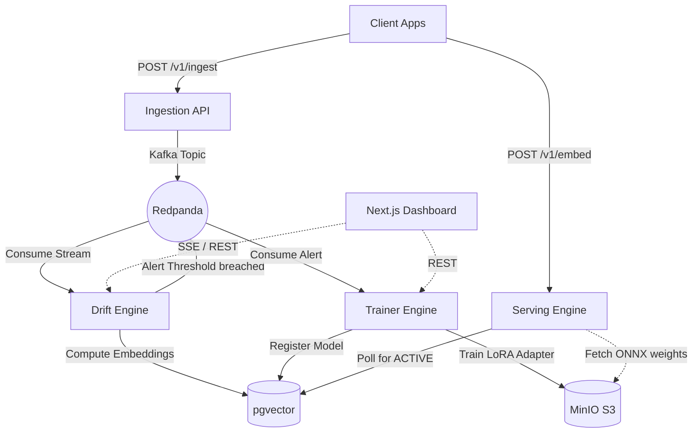

# Continuum 🌌

**Continuum** is a real-time embedding drift detection and autonomous fine-tuning platform.

Every production RAG and semantic search system suffers from semantic drift over time. The distribution of data flowing through the system shifts away from the distribution the embedding model was originally trained on. Continuum solves this by continuously monitoring the latent space for distribution shifts and automatically spinning up Low-Rank Adaptation (LoRA) fine-tuning jobs to adapt the model to the new domain—with zero downtime hot-swapping.

## Architecture



## Quickstart (E2E Demo)

Boot up the entire infrastructure and microservices with Docker Compose:

```bash
docker compose up --build -d
```

1. Open the Dashboard at `http://localhost:3000`
2. Run the seed script to inject baseline data and then induce a drift event:
   ```bash
   uv run scripts/seed.py
   ```
3. Watch the Dashboard as the drift score spikes, the training job triggers, and the new model version is produced!
4. Verify the new model improves MRR on the new domain:
   ```bash
   uv run eval/benchmark.py
   ```

See [DEMO.md](DEMO.md) for a detailed walkthrough.

## Services Overview

- **`apps/ingest`**: FastAPI service that validates document payloads and produces idempotently to Kafka.
- **`apps/drift`**: Computes running centroids of the embedding space and fires alerts based on Cosine distance.
- **`apps/trainer`**: Executes PEFT LoRA fine-tuning and performs A/B evaluation before registering models.
- **`apps/server`**: High-performance ONNX inference engine (REST + gRPC) with atomic hot-swapping.
- **`apps/dashboard`**: Next.js 15 UI for monitoring drift, training telemetry, and the model registry.
