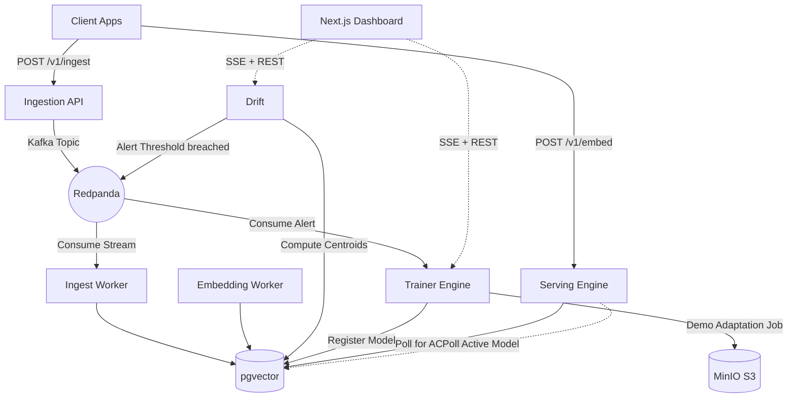

# Continuum 🌌

**Continuum** is a local real-time embedding drift detection and adaptive model registry demo.

Every production RAG and semantic search system suffers from semantic drift over time. The distribution of data flowing through the system shifts away from the distribution the embedding model was originally trained on. Continuum demonstrates the control loop: ingest documents, compute embeddings, score centroid drift, trigger an adaptation job, register a candidate model, and activate it from the dashboard.

## Architecture



## Production Ops

Continuum has two migration tracks. Prisma owns the product schema in
`packages/shared/prisma/migrations`; Alembic owns operational tables for hashed API keys,
request metrics, and rollback audit events in `packages/shared/alembic`.

```bash
pnpm ops:migrate
pnpm ops:migrate:test
```

Docker Compose runs the same Alembic upgrade through the `migrations` one-shot service before app
containers become eligible to serve traffic.

Long-running services declare `restart: unless-stopped` so a crash does not silently remove a
service from the loop. The one-shot containers (`redpanda-init`, `minio-init`, `migrations`)
deliberately have no restart policy, because dependents wait on them via
`service_completed_successfully` and a restart loop would block startup forever.

`DATABASE_URL` pins `connection_limit=10&pool_timeout=30`. Left implicit, Prisma sizes its pool
from the CPUs the container can see (`num_cpus * 2 + 1`), which the per-service `cpus` limits
reduce to 3 — small enough that the drift services exhaust it under sustained load and exit on
`Timed out fetching a new connection from the connection pool`. Postgres runs with
`max_connections=200` to leave headroom above the summed pools for migrations and seeding.
Alembic strips the Prisma-only parameters before psycopg sees the URL
(`continuum_shared.db_url`), since libpq rejects connection options it does not recognise.

Every FastAPI service emits structured JSON logs with an `x-correlation-id` value, and local
OpenTelemetry spans are exported to stdout. Set `API_KEY_BCRYPT_HASH` instead of `API_KEY` in
real deployments; plaintext `API_KEY` exists only for local development compatibility.

`retention-worker` runs the cleanup policy on a schedule:

- embeddings older than `RETENTION_EMBEDDINGS_DAYS` (default 90)
- drift and linguistic windows older than `RETENTION_DRIFT_WINDOWS_DAYS` (default 30)
- training jobs older than `RETENTION_TRAINING_JOBS_DAYS` (default 365)

`DRIFT_TRIGGER_MIN_EMBEDDING_DRIFT` is on the same scale as `DRIFT_THRESHOLD`: centroid cosine
distance, where a domain shift reads around 0.10. Keep it at or below the alert threshold, or the
throttler suppresses every alert the drift service raises and only linguistic drift can trigger
training.

The serving engine tracks request outcomes per model version. If the active model exceeds
`ROLLBACK_ERROR_RATE_THRESHOLD` over `ROLLBACK_WINDOW_SECONDS` with at least
`ROLLBACK_MIN_REQUESTS`, it archives the failing version, restores the previous active model,
and records a rollback event.

## Quickstart (E2E Demo)

Boot up the entire infrastructure and microservices with Docker Compose:

```bash
docker compose up --build -d
```

Compose healthchecks gate the app startup path: APIs wait for Redpanda/Postgres/Redis/MinIO as needed, and the dashboard waits for the drift and trainer APIs to become healthy.

To verify the exposed services from the host after startup:

```bash
pnpm stack:health
```

1. Open the Dashboard at `http://localhost:3000`
2. Run the seed script to inject baseline data and then induce a drift event:
   ```bash
   uv run scripts/seed.py
   ```
3. Watch the Dashboard as the drift score spikes, the training job triggers, and the new model version is produced!
4. Inspect retrieval quality for the active model on the new domain:
   ```bash
   uv run eval/benchmark.py
   ```
5. Or verify the full demo narrative end-to-end:
   ```bash
   pnpm demo:verify
   ```

See [DEMO.md](DEMO.md) for a detailed walkthrough.

### Trainer Backends

The local quickstart defaults to `TRAINER_BACKEND=demo_adapter`, which keeps the laptop
demo fast and serving-compatible. For production LoRA training, set:

```bash
uv sync --package continuum-trainer --extra peft
TRAINER_BACKEND=peft
```

The PEFT backend trains `sentence-transformers/all-MiniLM-L6-v2` with LoRA in-batch
contrastive loss, exports ONNX through Optimum, uploads adapter/ONNX artifacts to MinIO,
and marks the model version as `PENDING_EVAL` with `domain_tag`, `onnx_path`, and
`eval_mrr` registry fields.

### Linguistic Drift

`continuum-linguistic-drift` adds a second drift signal over raw document text. It compares
rolling windows against the baseline corpus for entity movement, topic movement, and
vocabulary shift, stores results in `linguistic_windows`, publishes `linguistic-drift-alerts`,
and streams live dashboard updates from `http://localhost:8004/v1/linguistic/events`.

## Validation

The default checks do not require Docker:

```bash
pnpm lint
pnpm type-check
pnpm test
pnpm build
docker compose config -q
```

To verify the complete compose stack from a clean local state:

```bash
docker compose --env-file .env.example -f infra/docker-compose.yml down -v
docker compose --env-file .env.example -f infra/docker-compose.yml up --build -d --wait
pnpm stack:health
pnpm demo:verify
```

Docker-backed Testcontainers checks are opt-in:

```bash
pnpm test:integration
```

## Services Overview

- **`apps/ingest`**: FastAPI service that validates document payloads and produces idempotently to Kafka.
- **`apps/embedding`**: Computes deterministic offline demo embeddings and stores them in pgvector.
- **`apps/drift`**: Computes rolling centroids of the embedding space and fires alerts based on cosine distance.
- **`apps/trainer`**: Runs a deterministic demo adaptation/evaluation job before registering models.
- **`apps/server`**: REST + gRPC embedding service with active-model polling and hot-swap state.
- **`apps/dashboard`**: Next.js 15 UI for monitoring drift, training telemetry, and the model registry.
